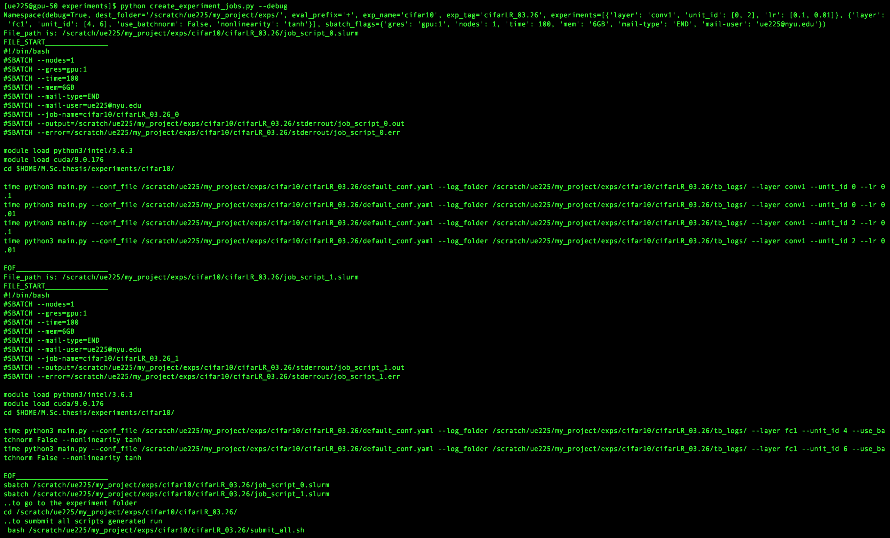
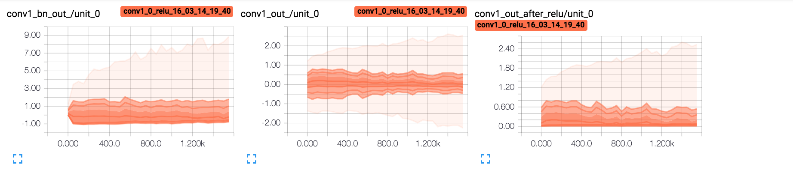
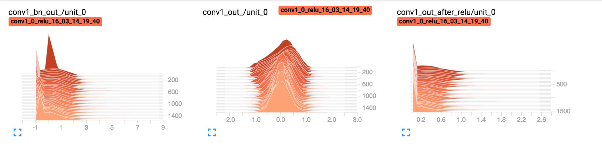
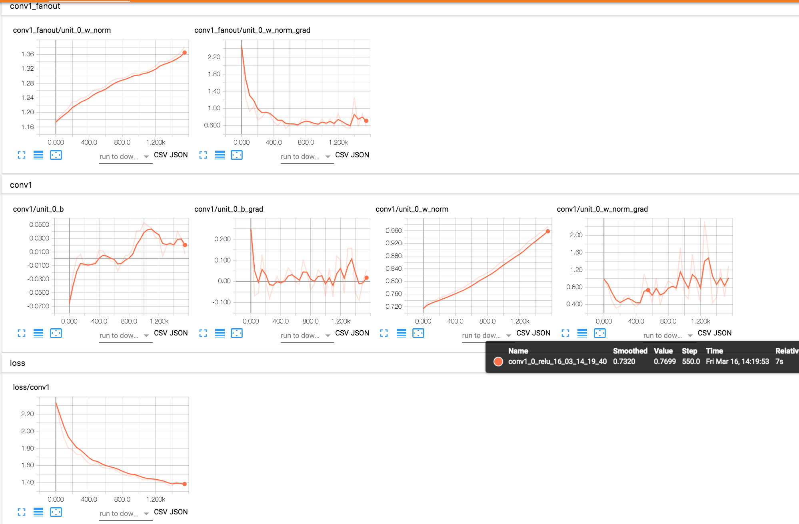

# exp.bootstrp
This repo is a bootstrap for experiments and includes helper functions scripts for pytorch training and slurm job scheduler.

## Quick Start
First thing setup your [ssh workflow](https://evcu.github.io/notes/ssh-setup-notes/). Then lets kick-start our experiment.

```bash
ssh prince
git clone git@github.com:evcu/exp.bootstrp.git
mv exp.bootstrp my_exp
cd my_exp
```

First debug the experiment on a interactive session
prince_slurm_bootstrap.sh loads the modules needed, update as needed.
Personally I am using python3 with pip --user packages. You can call it with install for the first time

```bash
srun -t2:30:00 --mem=5000 --gres=gpu:1 --pty /bin/bash

. ./prince_slurm_bootstrap.sh install
cd experiments/cifar10/
python main.py --epoch 1
```

After we are sure that our main script works, we can start create automated experiments with
`create_experiment_jobs.py` scripts

```bash
cd ../
python create_experiment_jobs.py --debug
```
if they all look nice then you can create the experiment folder. and submit the jobs
```bash
python create_experiment_jobs.py
bash /scratch/ue225/my_project/exps/cifar10/cifarLR_03.26/submit_all.sh
```
which would output something like this


Let say you wanna define a new experiment. You would do by creating a new folder `experiments/new_folder/` and a `experiments/new_folder/main.py`script that is intended to be run. The main.py script should accept
`--log_folder` and `--conf_file` flags at minimum. Then you can change `exp_name` at `experiments/default_conf.yaml` to `new_folder` and create new experiments.

## Features
- [read_yaml_args](https://github.com/evcu/exp.bootstrp/blob/master/experiments/exp_utils.py#L224) reads conf.yaml and creates a type-checked argParser out of the definition. Write the conf, read and overwrite with cli args.
- [Customizable eval-prefixes](https://github.com/evcu/exp.bootstrp/blob/master/experiments/exp_utils.py#L175) inside yaml file, which enables defining programatic eval-able arguments.
  i.e. the string '+range(5)' would be evaluated and read as the list.
- configuration [copy to the experiment folder](https://github.com/evcu/exp.bootstrp/blob/master/experiments/create_experiment_jobs.py#L34) such that you can always change experiments default_args after submission
- [ClassificationTrainer](https://github.com/evcu/exp.bootstrp/blob/master/experiments/exp_utils.py#L83)/[ClassificationTester](https://github.com/evcu/exp.bootstrp/blob/master/experiments/exp_utils.py#L9) which wraps the main training/testing
functionalities and provides hooks for loggers.
- tensorboardX [logging utils](https://github.com/evcu/exp.bootstrp/blob/master/experiments/exp_loggers.py) and examples.
- [convNetgeneric](https://github.com/evcu/exp.bootstrp/blob/master/experiments/exp_models.py#L67) implementation
- [Multiple experiment definitions](https://github.com/evcu/exp.bootstrp/blob/master/experiments/default_conf.yaml#L6) through yaml lists.

## Visualizing Tensorboard Events
there are several options
- You can scp like
```bash
scp prince:/scratch/ue225/my_project/exps/cifar10/cifarLR
.26/tb_logs ./
```
- You can open a tunnel to the prince and run tensorboard on prince and connect to it through port forwarding. You can look my (remote Jupyter and port forwarding](https://evcu.github.io/notes/port-forwarding/) notes.
- You can use sshfs and get the logs sync into your local file system. Details [here](https://evcu.github.io/notes/ssh-setup-notes)

and read your results



